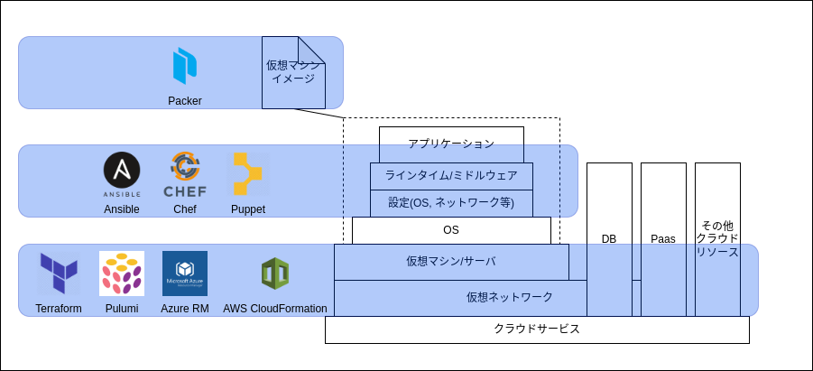
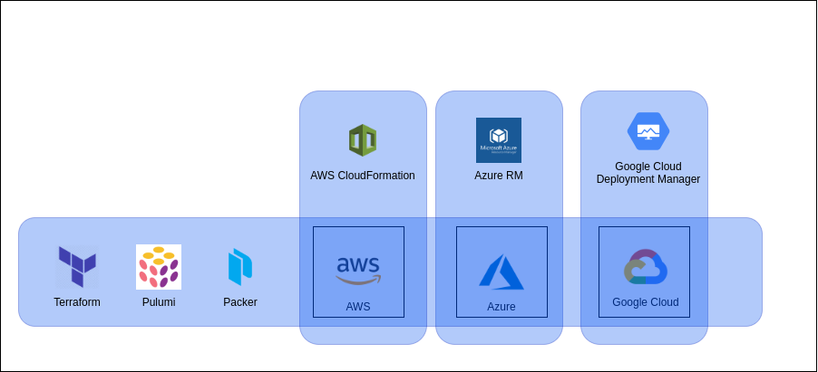

# Terraform

---

## 目次

1. .terraform.lock.hclファイルについて
2. for_eachの使い方
3. dynamicの使い方
4. 値の重複と順序による差分について
5. nullの動きについて

---

## Terraform とは

HashiCorp社が開発した **IaC(Infrastructure as Code)** を実現しやすくするための **構成管理ツール**

---

## IaCとは

インフラ（サーバー、ネットワーク、データベース、ストレージなど）をコードとして管理・構築する手法のこと

>>>

### IaCの特徴とメリット

1. 一貫性と再現性の確保
    * 同じコードを実行すれば、どこでも同じインフラを構築可能
    * 設定のばらつきを防ぎ、トラブルシューティングが容易
2. 自動化と効率化
    * 手作業による設定ミスを防ぎ、迅速に環境を構築できる
    * 環境の再現性が高まり、開発・運用のスピード向上
3. バージョン管理が可能
    * Git などのバージョン管理システムでインフラの設定を管理できる
    * 過去の設定との差分を追跡し、変更を管理しやすい

>>>

### IaCのない世界

1. 手作業による設定ミスの多発
    * 各サーバーやネットワーク機器を手作業で設定するため、人為的ミス増加
    * 設定の抜けや誤りによる本番環境での障害が頻発
2. 環境の一貫性が保てない
    * 開発環境、テスト環境、本番環境の手動設定のミスによる差異
        * **本番では動くのに、開発環境では動かない** といった問題が発生
    * 既存リソースの増設で手動設定のミスによる差異
3. 環境構築・変更に時間がかかる
    * OSインストールや設定の適用などサーバー準備時間などによる構築時間の増加
    * 依存関係の洗い出しなど変更による影響調査
4. 障害復旧が困難
    * 万が一サーバーが壊れた場合、手作業で再構築する必要があり、復旧に時間がかかる
    * 障害が発生しても、過去の構成履歴がないため**正しい設定がわからない**

>>>

### IaCのための構成管理ツール(サービス)

* Terraform/OpenTofu
* Pulumi
* Azure Resource Manager
* AWS CloudFormation
* Ansible
* Chef
* Puppet
* Packer
* ...

---

## 構成管理ツールの違い

>>>

### 得意分野の違い



>>>

#### 対応クラウドサービスの違い



---

## Terraformのブロック

### バックエンドブロック


---

## .terraform.lock.hcl

>>>

### .terraform.lock.hclとは？

>>>

Terraformの依存関係ロックファイル。Terraformのバージョン、プロバイダーのバージョン、およびモジュールのバージョンを記録することで、プロジェクトの依存関係を固定して、異なる環境や異なる時期に同じ環境を再現させるためのもの。

Note:
package-lock.jsonのようなもの

>>>

<!-- .slide: data-code-style -->
```hcl
# This file is maintained automatically by "terraform init".
# Manual edits may be lost in future updates.

provider "registry.terraform.io/hashicorp/azurerm" {
  version     = "3.117.0" // terraformが使用するバージョン
  constraints = "~> 3.117.0" // バージョンの成約
  hashes = [
    "h1:Ynfg+Iy7x6K8M6W1AhqXCe3wkoiqIQhROlca7C3KC3w=",
    "zh:2e25f47492366821a786762369f0e0921cc9452d64bfd5075f6fdfcf1a9c6d70",
    "zh:41eb34f2f7469bf3eb1019dfb0e7fc28256f809824016f4f8b9d691bf473b2ac",
    "zh:48bb9c87b3d928da1abc1d3db75453c9725de4674c612daf3800160cc7145d30",
    "zh:5d6b0de0bbd78943fcc65c53944ef4496329e247f434c6eab86ed051c5cea67b",
    "zh:78c9f6fdb1206a89cf0e6706b4f46178169a93b6c964a4cad8a321058ccbd9b4",
    "zh:793b702c352589d4360b580d4a1cf654a7439d2ad6bdb7bfea91de07bc4b0fac",
    "zh:7ed687ff0a5509463a592f97431863574fe5cc80a34e395be06766215b8c6285",
    "zh:955ba18789bd15592824eb426a8d0f38595bd09fffc6939c1c58933489c1a71e",
    "zh:bf5949a55be0714cd9c8815d472eae4baa48ba06d0f6bf2b96775869acda8a54",
    "zh:da5d31f635abd2c645ffc76d6176d73f646128e73720cc368247cc424975c127",
    "zh:eed5a66d59883c9c56729b0a964a2b60d758ea7489ef3e920a6fbd48518ce5f5",
    "zh:f569b65999264a9416862bca5cd2a6177d94ccb0424f3a4ef424428912b9cb3c",
  ]
}
```

Note: h1 がバイナリのチェックサム、 zh はzipの状態のチェックサム


>>>

#### チェックサムミスマッチエラー(v1.3まで)

* zhのチェックサムがない状態でh1のチェックサムが記録されていると発生するエラー

>>>

* キャッシュが関係しておりキャッシュディレクトリにzhのzipファイルが存在した状態で `terraform init` するとzhが記録されずにh1だけ記録されることにより発生する
* v1.4 以降は発生しにくくなる(※v1.3で作成したlock.hclを使用すると発生する可能性がある)

>>>

#### 参考

* [.terraform.lock.hcl 完全に理解した](https://speakerdeck.com/minamijoyo/how-to-update-terraform-dot-lock-dot-hcl-efficiently)
* [Feature request: Generate .terraform.lock.hcl including zh and h1 hash values for given platforms from required_providers block without downloading providers and modules #27264](https://github.com/hashicorp/terraform/issues/27264#issuecomment-743389837)

---

## aa

---

## A

CC

## B

DD

<div style="display: flex; top: 90px;">
  <div style="margin-right: 50px;">
    
  </div>
  <div style="text-align: left;">
    <div>guri3</div>
    <div>HTMLとCSSでも書ける</div>
    <div>色々自由にいじれていいね</div>
  </div>
</div>

Note:
発表時の原稿とかはこんな風に書けるよ

---

コードスニペットも綺麗

``js // Qiitaの表示につき調整してます、本来は「```」です。
const a = 1;
const b = 2;

console.log(a + b);
// => 3
``

---

`>>>`で下方向にも移動できる

>>>

<b style="color: yellow">文字色</b>とか<b style="font-size: 120px;">文字サイズ</b>も自在

---

## ありがとうございました！